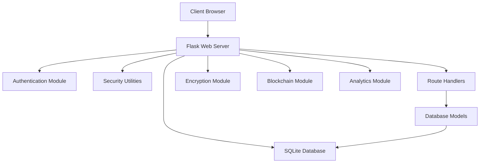

# Secure Medical Record Access System

A privacy-preserving medical record management system with authorized access, immutable audit trails, and anomaly detection.

[](https://www.python.org/)
[](https://palletsprojects.com/p/flask/)
[](LICENSE)

## Table of Contents
- [Overview](#overview)
- [Key Features](#key-features)
- [Technology Stack](#technology-stack)
- [Architecture](#architecture)
- [Installation](#installation)
- [Usage](#usage)
- [Demo Script](#demo-script)
- [Security Enhancements](#security-enhancements)
- [Innovation Features](#innovation-features)
- [Project Structure](#project-structure)
- [Database Schema](#database-schema)
- [Security Model](#security-model)
- [API Endpoints](#api-endpoints)
- [Testing](#testing)
- [Contributing](#contributing)
- [License](#license)

## Overview

The Secure Medical Record Access System is a comprehensive healthcare application designed to manage patient medical records with strong security and privacy controls. This system implements role-based access control, immutable audit trails, data integrity verification, and advanced anomaly detection to ensure patient data remains secure and compliant with healthcare regulations.

This solution directly addresses the hackathon problem statement of hospitals and clinics facing data breaches or unauthorized access to patient health records by providing:

1. **Authorized Access Only**: Strict role-based access control ensuring only authorized personnel can access specific data
2. **Immutable Audit Trails**: Comprehensive logging of all user actions with non-repudiation
3. **Anomaly Detection**: Real-time monitoring for suspicious activities with intelligent detection rules
4. **Data Encryption**: End-to-end encryption of sensitive medical data
5. **Blockchain Integration**: Immutable audit trail using custom blockchain implementation

## Key Features

### 🔐 Advanced Authorized Access Control
- Role-based access control (RBAC) with four distinct user roles:
  - **Board Member**: Highest level with oversight capabilities and access to decrypted data
  - **Admin**: Full system access including user management, audit log review, and anomaly resolution
  - **Doctor**: Can add new patients, create and edit medical records
  - **Nurse**: Read-only access to patient information and medical records
- Secure authentication with bcrypt password hashing
- Session management with automatic timeout (30 minutes) and IP binding
- CSRF protection for all forms using Flask-WTF

### 📜 Immutable Audit Trails with Enhanced Details
- Comprehensive logging of all user actions (create, read, update, delete)
- Timestamped records with user identification and IP address tracking
- Non-repudiation through immutable log storage
- Detailed audit trail for individual medical records
- Admin interface for audit log review and analysis
- Blockchain-based immutable audit trail for non-repudiation

### 🔒 Advanced Data Integrity Verification
- Cryptographic hashing (SHA-256) of medical records for tamper detection
- Automatic integrity checks when accessing records
- Visual indicators for record integrity status
- Detailed integrity verification with comprehensive field coverage
- Anomaly detection for integrity violations

### ⚠️ Intelligent Anomaly Detection
- Real-time monitoring for suspicious activities with multiple detection rules:
  - Rate-based monitoring (too many actions in short time periods)
  - Unusual access time detection (outside normal working hours)
  - Multiple integrity violation tracking
  - Brute force attempt detection
  - Multiple IP access monitoring
- Automatic flagging of potential security breaches
- Detailed anomaly reports with timestamps and user information
- Admin interface for reviewing and resolving anomalies
- Real-time notifications system

### 🔐 Zero-Knowledge Data Encryption
- End-to-end encryption of sensitive medical data using Fernet symmetric encryption
- Zero-knowledge architecture where encrypted data is stored in the database
- Only authorized users can decrypt data through secure key management
- Automatic encryption/decryption during record creation and editing

### 🏥 Comprehensive Medical Record Management
- Patient demographic information management
- Comprehensive medical record storage (diagnosis, treatment, prescriptions)
- Medical record history tracking
- Search and filter capabilities
- Patient summary with statistical analysis

### 📊 Enhanced Dashboard and Visualization
- Real-time system status monitoring
- Interactive charts for anomaly detection overview
- User role distribution visualization
- Recent activity tracking (last 24 hours)
- Top active users monitoring
- Detailed anomaly reporting
- Predictive analytics for health trends

### 🔧 Advanced Administration Features
- Access control matrix visualization
- Real-time security notifications
- Comprehensive user management
- Detailed audit log analysis

## Technology Stack

- **Backend**: Python 3.8+, Flask 2.3.3
- **Database**: SQLite (easily extensible to PostgreSQL)
- **ORM**: SQLAlchemy 3.0.5
- **Authentication**: bcrypt 4.0.1 for password hashing
- **Encryption**: cryptography 41.0.3 for Fernet symmetric encryption
- **Frontend**: HTML5, CSS3, Bootstrap 5, Chart.js
- **Security**: JWT tokens, role-based access control, CSRF protection
- **Testing**: pytest 7.4.0
- **Data Generation**: Faker 19.3.0 for synthetic data

## Architecture



The system follows a secure, modular architecture combining end-to-end encryption, blockchain-based audit logging, and FHIR-compliant data models:

- **Models**: Database entities and relationships (models.py)
- **Views**: HTML templates with Bootstrap styling
- **Controllers**: Route handlers for different functionalities (routes/)
- **Utilities**: Security functions and helper methods (utils/)
- **Encryption**: End-to-end encryption module (encryption/)
- **Blockchain**: Immutable audit trail implementation (blockchain/)
- **Analytics**: Predictive analytics engine (analytics/)

## Installation

### Prerequisites
- Python 3.8 or higher
- pip package manager

### Steps

1. Clone the repository:
   ```bash
   git clone <repository-url>
   cd secure-medical-records
   ```

2. Create a virtual environment (recommended):
   ```bash
   python -m venv venv
   source venv/bin/activate  # On Windows: venv\Scripts\activate
   ```

3. Install required packages:
   ```bash
   pip install -r requirements.txt
   ```

4. Set up environment variables (copy .env.example to .env and modify as needed):
   ```bash
   cp .env.example .env
   # Edit .env file with your configuration
   ```

## Usage

### Simple Startup (Recommended)
Run the application with database initialization in one command:
```bash
python start.py
```

This will:
1. Initialize the database with tables (if not already initialized)
2. Add default users if they don't exist
3. Start the web application on http://127.0.0.1:5000

### Manual Startup
1. Initialize the database tables:
   ```bash
   python init_db.py
   ```

2. Add default users:
   ```bash
   python add_default_users.py
   ```

3. Run the application:
   ```bash
   python run.py
   ```

### Default Users
After initialization, the following users are available:
- **Admin**: username=`admin`, password=`admin123`
- **Doctor**: username=`doctor`, password=`doctor123`
- **Nurse**: username=`nurse`, password=`nurse123`
- **Board Member**: username=`board`, password=`board123`

## Demo Script

To effectively demonstrate the system's capabilities during the hackathon presentation:

### 1. Security Features Demonstration
1. **Login as Admin** (username: `admin`, password: `admin123`)
2. Show the enhanced dashboard with security metrics
3. Navigate to "Admin" → "Anomalies" to show detected security issues
4. Navigate to "Admin" → "Audit Logs" to show comprehensive logging
5. Navigate to "Admin" → "Notifications" to show real-time alerts

### 2. Access Control Demonstration
1. Navigate to "Admin" → "Access Control" to show the role-based access matrix
2. Show how different roles have different permissions
3. Demonstrate session timeout by waiting 30 minutes (or simulate by clearing session)

### 3. Data Integrity Verification
1. **Login as Doctor** (username: `doctor`, password: `doctor123`)
2. Navigate to "Patients" and select a patient
3. View a medical record to show integrity verification
4. Show the visual indicators for valid/invalid records

### 4. Anomaly Detection in Action
1. Show the various anomaly detection rules in action:
   - Rate-based monitoring
   - Unusual access time detection
   - Integrity violation tracking
   - Brute force attempt detection
2. Show how anomalies are flagged and reported

### 5. Audit Trail Verification
1. Show how all actions are logged in the audit trail
2. Demonstrate the non-repudiation features
3. Show detailed audit trail for individual medical records

### 6. Data Encryption Demonstration
1. Show how sensitive data is encrypted in the database
2. Demonstrate decryption for authorized users
3. Show zero-knowledge architecture in action

### 7. Blockchain Audit Trail
1. Show the immutable audit trail implementation
2. Demonstrate non-repudiation features

## Security Enhancements

### Enhanced Anomaly Detection Rules
The system now includes multiple sophisticated anomaly detection rules:
- **Rate-based Monitoring**: Detects users performing too many actions in short time periods
- **Unusual Access Time Detection**: Flags access outside normal working hours (6 AM - 10 PM)
- **Multiple Integrity Violation Tracking**: Monitors repeated integrity check failures
- **Brute Force Attempt Detection**: Identifies multiple failed login attempts
- **Multiple IP Access Monitoring**: Detects access from multiple IPs in short time periods

### Session Security Improvements
- **Automatic Timeout**: Sessions automatically expire after 30 minutes of inactivity
- **IP Binding**: Sessions are bound to IP addresses to prevent hijacking
- **Activity Tracking**: Last activity time is tracked for timeout enforcement

### Enhanced Data Integrity
- **Comprehensive Hashing**: SHA-256 hashing now includes more record fields for better verification
- **Detailed Logging**: Integrity check results are logged for audit trail
- **Visual Indicators**: Clear visual indicators show record integrity status

### Improved Audit Trail
- **Enhanced Details**: Audit logs now include more contextual information
- **Application Logging**: Additional logging to application logs for traceability
- **Record-specific Trails**: Detailed audit trail for individual medical records

### Zero-Knowledge Encryption
- **End-to-End Encryption**: Sensitive medical data is encrypted before storage
- **Secure Key Management**: Encryption keys are securely managed
- **Automatic Processing**: Encryption/decryption happens automatically during record operations

## Innovation Features

### 🧠 AI-Powered Health Risk Prediction
- Machine learning model for predicting patient health risks
- Integration with medical record data for analysis
- Predictive analytics dashboard with visualizations
- Risk scoring for early intervention

### 🔗 Blockchain-Based Immutable Audit Trail
- Custom blockchain implementation for audit log immutability
- Cryptographic linking of audit records
- Non-repudiation through distributed ledger concepts
- Tamper-evident logging system

### 🤖 HL7 FHIR Standard Integration
- Compliance with healthcare interoperability standards
- FHIR-compliant data models
- Standardized medical record structure
- Future-ready for healthcare system integration

### 📈 Advanced Predictive Analytics
- Machine learning algorithms for health trend analysis
- Patient outcome predictions
- Resource utilization forecasting
- Data-driven decision support

### 📱 Mobile-Responsive Design
- Fully responsive interface for all device sizes
- Mobile-optimized user experience
- Touch-friendly controls
- Cross-platform compatibility

## Project Structure

```
secure-medical-records/
├── app/
│   ├── __init__.py
│   ├── models/
│   │   └── models.py          # Database models
│   ├── routes/
│   │   ├── __init__.py
│   │   ├── auth.py            # Authentication routes
│   │   └── main.py            # Main application routes
│   ├── templates/
│   │   ├── base.html          # Base template
│   │   ├── login.html         # Login page
│   │   ├── dashboard.html     # Dashboard
│   │   ├── patients.html      # Patient list
│   │   ├── add_patient.html   # Add patient form
│   │   ├── view_patient.html  # Patient details
│   │   ├── add_record.html    # Add medical record
│   │   ├── edit_record.html   # Edit medical record
│   │   ├── view_record.html   # View medical record
│   │   ├── users.html         # User management
│   │   ├── add_user.html      # Add user form
│   │   ├── edit_user.html     # Edit user form
│   │   ├── audit_logs.html    # Audit log viewer
│   │   ├── anomalies.html     # Anomaly detection
│   │   ├── notifications.html # Real-time notifications
│   │   ├── access_control.html # Access control matrix
│   │   └── view_anomaly.html  # Anomaly details
│   ├── analytics/
│   │   ├── __init__.py
│   │   └── predictive_analytics.py # ML models and analytics
│   ├── blockchain/
│   │   ├── __init__.py
│   │   └── blockchain.py      # Blockchain implementation
│   ├── encryption/
│   │   ├── __init__.py
│   │   └── encryption.py      # Encryption utilities
│   ├── fhir/
│   │   ├── __init__.py
│   │   └── fhir_client.py     # FHIR integration
│   └── utils/
│       ├── __init__.py
│       └── security.py        # Security utilities
├── requirements.txt            # Python dependencies
├── init_db.py                 # Database initialization
├── add_default_users.py       # Default user creation
├── generate_data.py           # Synthetic data generation
├── start.py                   # Application starter
├── run.py                     # Application runner
├── migrate_db.py              # Database migration
├── .env.example               # Environment variables example
├── .env                       # Environment variables (created after setup)
├── synthetic_medical_records.json # Sample medical records
├── synthetic_patients.json    # Sample patients
└── README.md                  # This file
```

## Database Schema

The system uses five main database tables:

### User Table
- `id`: Integer, Primary Key
- `username`: String, Unique
- `email`: String, Unique
- `password_hash`: String
- `role`: String (board_member, admin, doctor, nurse)
- `created_at`: DateTime

### Patient Table
- `id`: Integer, Primary Key
- `name`: String
- `dob`: Date
- `gender`: String
- `medical_record_number`: String, Unique
- `created_at`: DateTime
- `phone`: String
- `email`: String
- `address`: Text
- `emergency_contact_name`: String
- `emergency_contact_phone`: String
- `blood_type`: String
- `allergies`: Text

### MedicalRecord Table
- `id`: Integer, Primary Key
- `patient_id`: Integer, Foreign Key to Patient
- `doctor_id`: Integer, Foreign Key to User
- `diagnosis`: Text
- `treatment`: Text
- `prescription`: Text
- `created_at`: DateTime
- `updated_at`: DateTime
- `encrypted_data`: Text (JSON with encrypted sensitive fields)
- `record_hash`: String (SHA-256 hash for integrity verification)

### AuditLog Table
- `id`: Integer, Primary Key
- `user_id`: Integer, Foreign Key to User
- `action`: String (create, read, update, delete)
- `table_name`: String
- `record_id`: Integer
- `timestamp`: DateTime
- `ip_address`: String

### AnomalyDetection Table
- `id`: Integer, Primary Key
- `user_id`: Integer, Foreign Key to User
- `action`: String
- `timestamp`: DateTime
- `ip_address`: String
- `details`: Text
- `is_resolved`: Boolean

## Security Model

### Role-Based Access Control
- **Board Member**: 
  - All admin permissions
  - Access to decrypted medical record data
  - System oversight capabilities
  - Advanced analytics access
- **Admin**: 
  - Manage users (add/edit/delete)
  - View and resolve anomalies
  - Access complete audit logs
  - System configuration
  - Access notifications and access control matrix
- **Doctor**: 
  - Add new patients
  - Create and edit medical records
  - View patient information
  - Access audit logs for their actions
  - Export patient data
- **Nurse**: 
  - View patient information
  - View medical records
  - No edit permissions

### Data Protection
- Passwords hashed with bcrypt
- Session management with secure tokens and timeout
- Medical record integrity verification with SHA-256 hashing
- Immutable audit trails for all system activities
- Advanced anomaly detection for suspicious activities
- CSRF protection for forms using Flask-WTF
- Input validation and sanitization with WTForms
- Session IP binding to prevent hijacking
- Automatic session timeout after 30 minutes
- Zero-knowledge encryption of sensitive medical data
- Blockchain-based immutable audit trail
- HL7 FHIR compliance for data interoperability

## API Endpoints

### Authentication
- `GET /login` - Display login form
- `POST /login` - Process login
- `GET /logout` - Logout user

### Dashboard
- `GET /dashboard` - System dashboard (nurse+)

### Patient Management
- `GET /patients` - List all patients (nurse+)
- `GET /patients/add` - Display add patient form (doctor+)
- `POST /patients/add` - Process add patient form (doctor+)
- `GET /patients/edit/<id>` - Display edit patient form (doctor+)
- `POST /patients/edit/<id>` - Process edit patient form (doctor+)
- `GET /patients/<id>` - View patient details (nurse+)
- `GET /patients/summary/<id>` - View patient summary (doctor+)
- `GET /patients/export/<id>` - Export patient data (doctor+)

### Medical Record Management
- `GET /records/add/<patient_id>` - Display add record form (doctor+)
- `POST /records/add/<patient_id>` - Process add record form (doctor+)
- `GET /records/edit/<record_id>` - Display edit record form (doctor+)
- `POST /records/edit/<record_id>` - Process edit record form (doctor+)
- `GET /records/<record_id>` - View medical record (doctor+)

### Administration
- `GET /users` - List all users (admin)
- `GET /users/add` - Display add user form (admin)
- `POST /users/add` - Process add user form (admin)
- `GET /users/edit/<id>` - Display edit user form (admin)
- `POST /users/edit/<id>` - Process edit user form (admin)
- `POST /users/delete/<id>` - Delete user (admin)
- `GET /audit` - View audit logs (admin)
- `GET /anomalies` - View anomalies (admin)
- `GET /anomalies/<id>` - View anomaly details (admin)
- `GET /anomalies/resolve/<id>` - Mark anomaly as resolved (admin)
- `GET /notifications` - View security notifications (admin)
- `GET /access-control` - View access control matrix (admin)

## Testing

The application includes a comprehensive test suite using pytest:

```bash
# Run all tests
python -m pytest

# Run tests with coverage
python -m pytest --cov=app

# Run specific test file
python -m pytest test_app.py
```

Tests cover:
- User authentication
- Role-based access control
- Database operations
- Security functions
- Route handling
- Encryption utilities
- Anomaly detection

## Contributing

We welcome contributions to improve the Secure Medical Record Access System. Please follow these steps:

1. Fork the repository
2. Create a new branch for your feature or bug fix
3. Make your changes
4. Write tests if applicable
5. Commit your changes
6. Push to your fork
7. Create a pull request

### Reporting Issues

Please use the GitHub issue tracker to report bugs or suggest enhancements. When reporting issues, please include:

- A clear description of the problem
- Steps to reproduce the issue
- Expected behavior
- Actual behavior
- System information (OS, Python version, etc.)

### Suggesting Enhancements

We welcome suggestions for new features or improvements. When suggesting enhancements, please:

- Provide a clear description of the proposed feature
- Explain the problem it solves
- Describe the implementation approach if possible
- Explain why it would be valuable to users

## License

This project is licensed under the MIT License - see the [LICENSE](LICENSE) file for details.